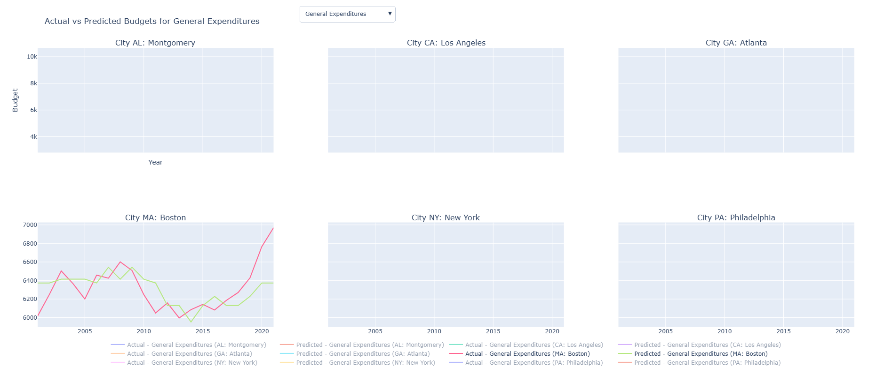
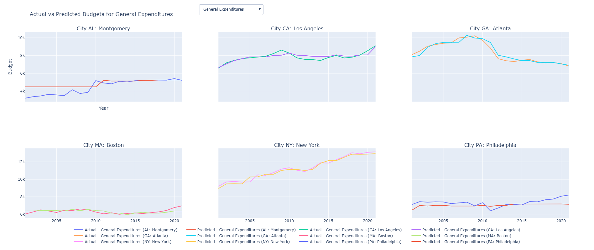

# Boston Budgetary Analysis Project
---
## Introduction
https://youtu.be/_ajM9b9Qr54
For our CS 506: Data Science Tools and Applications, our group analyzed budget data for the US city of Boston. We observed historical trends and created expectations for the upcoming fiscal year 2025. Our analysis focused largely on contextualizing the budget through polished visualization techniques. Additionally, we built a model capable of predicting annual budgetary allotments. Depending on the depth of our data, this was more feasible for certain datasets than others. For instance, one dataset only provided four years' worth of data, which limited accurate modeling. Nonetheless, we successfully uncovered patterns in Boston's budget allocation and spending strategies.

---

## Data
We utilized a mix of two primary datasets which detail the operating and capital budget of the city:

1. [Operating Budget](https://data.boston.gov/dataset/operating-budget/resource/8f2971f0-7a0d-401d-8376-0289e3b810ba)
2. [Capital Budget](https://data.boston.gov/dataset/capital-budget/resource/c62d666e-27ea-4c03-9cb1-d3a81a1fb641)

These were supplemented with other datasets containing additional context about spending patterns and funding priorities. In addition, we looked at budgets and expense of other major metropoliton cities and datasets containing information on Boston's geographic data. 

### Data Processing 
Our general data cleaning process included:
1. **Converting Budget Values**: Removing commas and converting budget columns to numerical format.
2. **Handling Missing Values**: Using forward and backward filling methods to address gaps.

---

## Key Statistics and Initial Visualizations 
#### General Expense Category Statistics
---

| Statistic                          | Value                      |
|------------------------------------|----------------------------|
| **Total Number of Categories**     | 7                          |
| **Total Spending (All Years)**     | $16,652,547,144.61        |
| **Average Spending per Category**  | $594,733,826.59           |
| **Standard Deviation in Spending** | $741,083,824.22           |

---

##### Highest and Lowest Spending Categories (by expense category)

| Category               | Spending                 |
|------------------------|--------------------------|
| **Highest Spending**   | Personnel Services ($8,420,974,086.06) |
| **Lowest Spending**    | Equipment ($150,647,254.23)            |

---

##### Year-Wise Spending Statistics (by expense category)

| Year             | Total             | Mean            | Std Dev         | Min            | Max             |
|------------------|-------------------|-----------------|-----------------|----------------|-----------------|
| **FY22 Actual**  | $3,829,375,037.78 | $547,053,576.83 | $689,909,706.36 | $30,203,926.57 | $1,957,857,738.13 |
| **FY23 Actual**  | $4,037,893,106.27 | $576,841,872.32 | $721,065,316.82 | $39,543,066.45 | $2,036,400,470.19 |
| **FY24 Appropriation** | $4,244,402,356.34 | $606,343,193.76 | $746,772,279.58 | $38,934,845.12 | $2,126,586,071.73 |
| **FY25 Budget**  | $4,540,876,644.22 | $648,696,663.46 | $806,587,994.13 | $41,317,751.68 | $2,300,129,806.01 |

---

#### General Program Expense Statistics
| Statistic                     | Value                     |
|-------------------------------|---------------------------|
| **Total Number of Programs**  | 192                       |
| **Total Spending (All Years)**| $16,652,547,144.61       |
| **Average Spending per Program** | $21,683,004.09      |
| **Standard Deviation in Spending** | $58,369,415.61   |

---

##### Highest and Lowest Spending Programs (by program)

| Program                        | Spending                  |
|--------------------------------|---------------------------|
| **Highest Spending Program**   | Pensions ($1,518,693,684.40) |
| **Lowest Spending Program**    | IOAP ($34,575.01)        |

---

##### Year-Wise Spending Statistics (by program)

| Fiscal Year | Total Spending         | Mean              | Standard Deviation | Min      | Max               |
|-------------|------------------------|-------------------|---------------------|----------|-------------------|
| **FY22**    | $3,829,375,037.78      | $19,944,661.66   | $53,446,059.01     | $8,575   | $323,684,235.00   |
| **FY23**    | $4,037,893,106.27      | $21,030,693.26   | $56,986,148.30     | $4,443   | $381,918,656.00   |
| **FY24**    | $4,244,402,356.34      | $22,106,262.27   | $59,724,865.62     | $0.00    | $390,596,447.40   |
| **FY25**    | $4,540,876,644.22      | $23,650,399.19   | $63,320,589.50     | $0.00    | $422,494,346.00   |

---
### Initial Visualizations 
#### Budget by Major Class
- **[Proposed vs Revised Budgets by Major Class](./budget/Images/combined_proposed_revised_budgets.png)**
#### Budget by Cabinet 
- **[Spending Over Time by Cabinet](./cabinet/visualizations/spending_over_time_by_cabinet_interactive.png)**
#### Budget by Program
- **[FY25 Budget Projections by Program](./program/visualizations/interactive/budget_by_program_interactive_pie.png)**
- **[Least Volatile Changes by Program](./program/visualizations/interactive/least_volatile_changes_program_interactive.png)**
[Most Volatile Changes by Program](./program/visualizations/interactive/most_volatile_changes_program_interactive.png)
[Volatility Comparison by Program](./program/visualizations/interactive/volatility_comparison_by_program_interactive.png)
#### Budget by Expense Category 
- **[FY25 Budget Projections by Expense Category](./expenseCategory/visualizations/fy25_budget_by_expenseCategory_PieChart_interactive.png)**
- **[Spending Over Time by Expense Category](./expenseCategory/visualizations/expenseCategory_spending_over_time_interactive.png)**


---
## Reproducing Our Results
### For Initial Visualizations and Statistics 
#### Step 1: Set Up a Python Virtual Environment

1. Navigate to the root directory of your project using the terminal or command prompt.
    ```bash
    cd path/to/your/project
    ```
2. Create a virtual environment by running the following command:
    ```bash
    python -m venv venv
    ```
3. Activate the virtual environment:
    - On Windows:
      ```bash
      .\venv\Scripts\activate
      ```
    - On macOS and Linux:
      ```bash
      source venv/bin/activate
      ```

#### Step 2: Install Required Packages

1. With the virtual environment activated, install the necessary packages specified in your `requirements.txt` file:
    ```bash
    pip install -r requirements.txt
    ```

#### Step 3: Run Python Scripts

1. Execute all Python scripts in the project’s root directory using:
    ```bash
    for file in *.py; do python "$file"; done
    ```
    (For Windows, execute each file individually or use an equivalent batch command.)

#### Step 4: Run Jupyter Notebooks

1. Ensure Jupyter Notebook is installed. If not, install it:
    ```bash
    pip install jupyter
    ```
2. Launch Jupyter Notebook:
    ```bash
    jupyter notebook
    ```
3. Navigate to each `.ipynb` file and execute all cells sequentially to reproduce the analysis.

### For the Modeling Process
#### Option 1: Run the file manually

1. Execute the following command:
   ```bash
   python "PATH TO /models" /models/budget_modelling.py

#### Option 2: Makefile

1. Navigate to the root directory of your project using the terminal or command prompt.
    ```bash
    cd path/to/your/project
    ```
2. Execute the following command:
   ```bash
   make
   ```

---
### Github Workflow and Test Code

We followed an automated GitHub workflow to ensure code quality and reproducibility. Below is the configuration of our workflow (`python-app.yml`):

```yaml
name: Python application

on:
  push:
    branches: [ "main" ]
  pull_request:
    branches: [ "main" ]

permissions:
  contents: read

jobs:
  build:

    runs-on: ubuntu-latest

    steps:
    - uses: actions/checkout@v4
    - name: Set up Python 3.10
      uses: actions/setup-python@v3
      with:
        python-version: "3.10"
    - name: Install dependencies
      run: |
        python -m pip install --upgrade pip
        pip install flake8 pytest
        if [ -f requirements.txt ]; then pip install -r requirements.txt; fi
    - name: Lint with flake8
      run: |
        flake8 . --count --select=E9,F63,F7,F82 --show-source --statistics
        flake8 . --count --exit-zero --max-complexity=10 --max-line-length=127 --statistics
    - name: Test with pytest
      run: |
        pytest
```

---

## The Model

The primary model implemented in `budget_modeling.py` is a Gradient Boosting Regressor, designed to identify macro-level trends in Boston's budget data. The modeling strategy focuses on long-term insights rather than precision for individual data points. Key aspects include:

1. **Performance Characteristics:**
   - The model performs well in identifying broader budgetary trends. For instance, it successfully captures the peak in 2008 followed by a decrease due to the financial crisis, then tracks the subsequent recovery.
   - It is less effective in scenarios with limited forewarning, such as sudden increases in healthcare spending due to the COVID-19 pandemic.

2. **Trade-offs and Justifications:**
   - While the model does not excel in predicting exact annual budgets, it is highly effective for policy-level decisions. This aligns with the project goals, emphasizing trend analysis over precise predictions.
   - Examples of the model's trend-tracking ability are visualized in `/model_examples/Example1.png` (Boston-specific) and `/model_examples/Example2.png` (multi-city).

3. **Improvements and Enhancements:**
   - Recent iterations of the model incorporate year and one-hot encoding of budget types, improving accuracy.
   - A singular model for Boston has been developed, featuring iterative predictions and interactive graph generation. This model demonstrates a Mean Squared Error (MSE) of approximately 30,000, significantly outperforming the overall model.

4. **Limitations:**
   - The model struggles with datasets where trends are unclear or metrics are undefined. For example, it fails to predict New York's total budget accurately.
   - Certain edge cases reveal bugs, such as predicting all zeros for New York in 2003.

5. **Visualization and Interpretability:**
   - Most effort was dedicated to creating effective visualizations to support policy discussions. The model's outputs, while not flawless, are highly interpretable and align with the project's goals.

#### Components of the Model

1. **Data Preprocessing**:
   - **Function**: `preprocess_data`
   - **Objective**: Prepare raw budget data for analysis.
   - **Steps**:
     - Converts wide-format data to long-format for time-series analysis.
     - Cleans data by removing commas, converting types, and filling missing values.
     - Ensures consistency by making the `Year` column numeric.

2. **Visualization of Trends**:
   - **Function**: `interactive_city_trends`
   - **Objective**: Create interactive visualizations of budget trends by city.
   - **Features**:
     - Uses Plotly to generate interactive line charts.
     - Allows filtering by variables and cities for exploratory analysis.

3. **Feature Engineering**:
   - **Functions**: `prepare_data_for_gbm_all`, `prepare_data_for_gbm_category`
   - **Objective**: Prepare data for modeling.
   - **Steps**:
     - Creates lag features (`Lag1`, `Lag2`) to capture historical dependencies.
     - Applies one-hot encoding to categorical variables (e.g., `Variable`).
     - Splits data into training and testing sets.

4. **Model Training**:
   - **Function**: `train_gbm`
   - **Objective**: Train a Gradient Boosting Regressor.
   - **Steps**:
     - Fits the model to the training data.
     - Evaluates using Mean Squared Error (MSE).

5. **Interactive Prediction Visualization**:
   - **Function**: `visualize_predictions_interactive`
   - **Objective**: Visualize actual and predicted budgets interactively.
   - **Features**:
     - Plots predictions alongside actual values.
     - Provides dropdown filters for cities and variables.

6. **Future Predictions**:
   - **Function**: `generate_future_predictions`
   - **Objective**: Predict future budgets for selected cities.
   - **Steps**:
     - Uses the trained model to predict year-by-year budgets.
     - Builds on prior predictions for iterative forecasting.

7. **Future Budget Visualization**:
   - **Function**: `visualize_boston_predictions`
   - **Objective**: Display forecasted budgets interactively.
   - **Features**:
     - Includes traces for actual and predicted data.
     - Adds dropdowns to filter by variables.

8. **Workflow Integration**:
   - **Function**: `main_workflow`
   - **Objective**: Integrate all components into a seamless pipeline.
   - **Steps**:
     - Preprocesses data, trains models, generates forecasts, and visualizes results.

---


## Geographical Analysis 
### Overview
The geographic analysis component of this project examines spatial and demographic vulnerabilities across Boston neighborhoods using geographic information system (GIS) data. This analysis integrates climate vulnerability attributes, population metrics, and childcare affordability data to provide insights into how geographic and socioeconomic factors influence the city's fiscal needs and priorities.

### Key Insights
- **Medical Vulnerabilities**: The neighborhoods with higher medical illness counts, such as Mission Hill and Roxbury, were visualized using color-coded maps. These areas indicate a need for targeted healthcare infrastructure improvements and disaster response planning.
- **Childcare Costs**: Childcare affordability varied significantly across neighborhoods, with affordability challenges being highest in low-income areas like Mattapan and Dorchester.
- **Housing Dynamics**: Maps depicting housing vacancy rates highlighted clusters of vacant properties in neighborhoods like Hyde Park and Roslindale, suggesting potential areas for redevelopment or resource allocation.
- **Poverty and Accessibility**: Correlation between high poverty levels and low English proficiency was observed in areas like East Boston, underlining the importance of accessible services.

### Methodology

1. **Data Preparation**:
   - Loaded GIS data using `geopandas` and enriched it with demographic and childcare data.
   - Processed raw data by renaming columns, handling missing values, and converting percentages and monetary values into usable formats.

2. **Visualization**:
   - Basic visualizations: Generated exploratory plots for neighborhood-level data.
   - Advanced maps: Created thematic maps using `matplotlib` to display attributes like medical illness counts, poverty rates, and childcare costs.
   - Geographic centroids: Calculated and labeled neighborhood centroids to annotate maps for clarity.

3. **Integration**:
   - Merged childcare affordability data and broader demographic information with GIS data.
   - Used mapping tools to visualize disparities and geographic patterns.

4. **Feature Graphing**:
   - Automated the generation of feature-specific maps for all attributes, enabling comprehensive spatial analysis.


---
## Results 
### Key Findings 
**Model Performance**
- **Resilience in Economic Trends**: The budget shows a strong ability to adapt to economic cycles, evident in its post-2008 recovery and growth after initial pandemic disruptions.
- **Mean Squared Error (MSE) on Test Set**: 30,000 for Boston-specific model

### Key Visualizations 
Actual Versus Predicted Budgets for General Expenditures 
- **[For Boston](./models/model_examples/Example1.png)**

- **[For Other Major Cities](./models/model_examples/Example2.png)**



## Conclusions
The Boston Budgetary Analysis Project offers critical insights into the city’s financial patterns. By leveraging machine learning and visualization, the analysis highlights key trends, including resilience to economic challenges and consistent growth in personnel expenses. While limitations exist, such as the model's inability to handle unforeseen spending spikes, the findings provide actionable intelligence for policymakers. Future efforts could focus on enhancing predictive accuracy and addressing data sparsity issues to refine the model’s utility across diverse scenarios. Overall, this project lays the groundwork for informed fiscal decision-making and sets a precedent for similar studies in other urban contexts.
