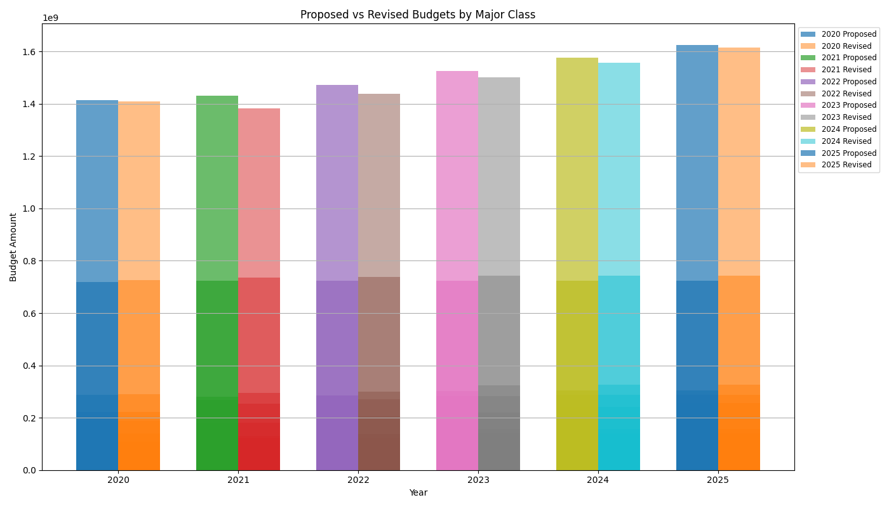
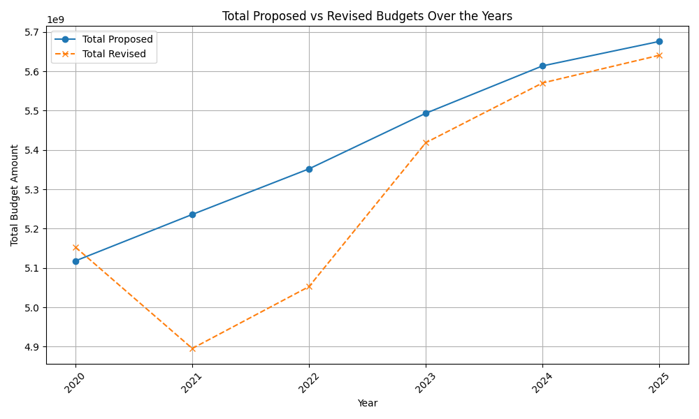
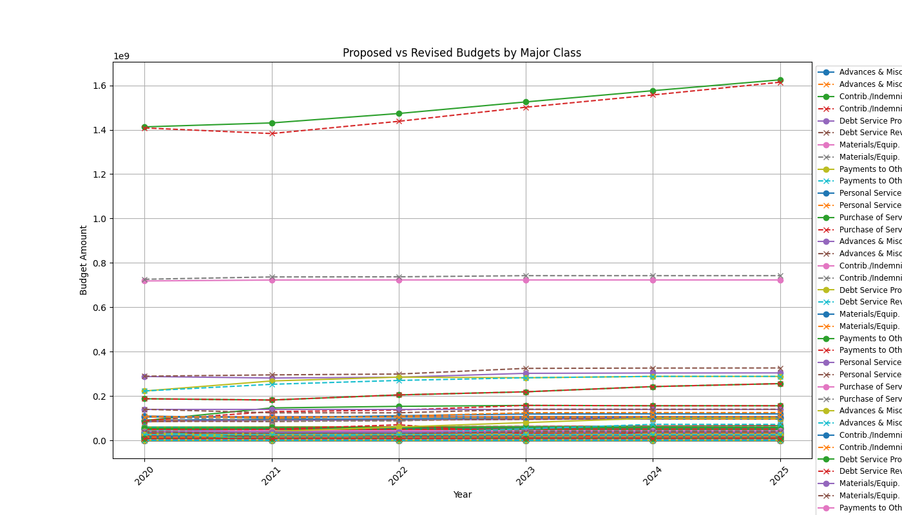

# Boston Budgetary Analysis Project
## Introduction
For our CS 506: Data Science Tools and Applications our group will be analysing budget data for the US city of Boston. We will both observe historical trends as well as expectations for the upcoming fiscal year 2025. Our analysis will focus largely on contextualizing the budget through polished visualization techniques. Secondarily, we hope to build a model capable of predicting annual budgetary allotments. Depending on the depth of our data, this may or may not be feasible. For example, one of our datasets only products four years worth of data, and this by itself would not provide enough data for accurate modelling or testing. Nonetheless, our goal is to find patterns in the way the city of Boston spends its money and how Boston plans to allocate funding.

## Data
The data that needs to be collected and visualized is a mix of two pre-provided datasets [detailing the operating](https://data.boston.gov/dataset/operating-budget/resource/8f2971f0-7a0d-401d-8376-0289e3b810ba) and [capital budget of the city](https://data.boston.gov/dataset/capital-budget/resource/c62d666e-27ea-4c03-9cb1-d3a81a1fb641), as well as various other datasets that may include information on domestic product trends, employment statistics, and housing inventory data. To obtain other data, we will refer primarily to the [Federal Reserve Bank of St. Louis](https://fred.stlouisfed.org/tags/series?t=boston#).

## Modelling
In the event that we find large amounts of budgetary data, our ideal testing plan is to simply exclude 25% of our data at random to be used as testing data. However, owing to a potentially small sample size of data, cross-validation will likely need to be deployed as well. Once we have a model that has been appropriately trained on our training data and verified to generalize on our testing data, we will predict budgetary outcomes under certain conditions (e.g., the year being 2025 or 2026).

During our exploratory data analysis, in the event of other compelling strong correlations between variables, we may opt to use tools we have seen in class including linear regression or K-Nearest Neighbors to visually model the relationships. For example, we might compare how the price of housing in Boston correlates to the city's budget for Fair Housing and Equity. 

As a resource to guide our visualizations, we will be referring to [DataToViz](https://www.data-to-viz.com/).

## Deliverables
### Midterm Deliverable
Our midterm deliverable will include the following:
- All of the data thus far that we have used to create visualizations.
- A GitHub workflow which runs and tests our various visualization methods.
- A `readme.md` *(this file)* describing our project and the necessary steps to reproduce our work.
- A `Makefile` to download dependencies, test the code, and run the processes.


### Our Final Deliverable
Our final deliverable will include all that is in the midterm deliverable and the following:
- All code used to change the datasets and create visualizations – including cleaning and any preparation.
- A final report document with topics concerning the entire scope of the project: Modelling (>= 1 models), visualizations (>= 5 graphics), methodologies, a detailed statistical summary with key findings.


## Midterm 
### Reproducing Our Results
To reproduce our results, please do the following:

#### Step 1: Set Up a Python Virtual Environment

1. Navigate to the root directory of your project using the terminal or command prompt.
    ```bash
    cd path/to/your/project
    ```

2. Create a virtual environment by running the following command:
    ```bash
    python -m venv venv
    ```

3. Activate the virtual environment:
    - On Windows:
      ```bash
      .\venv\Scripts\activate
      ```

    - On macOS and Linux:
      ```bash
      source venv/bin/activate
      ```

#### Step 2: Install Required Packages
1. With the virtual environment activated, install the necessary packages as specified in your `requirements.txt` file:
    ```bash
    pip install -r requirements.txt
    ```
#### Step 3: Run Python Files
1. Execute all Python scripts. Run all Python files located in our project's root directory by using the following command:
    ```bash
    for file in *.py; do python "$file"; done
    ```

   (Note: The above command is for Unix-like systems. If you are using Windows, you might need a different approach, such as using a batch script or running each file individually.)

#### Step 4: Run Jupyter Notebooks
1. Make sure Jupyter Notebook is installed. If not, install it using:
    ```bash
    pip install jupyter
    ```
2. Launch Jupyter Notebook:
    ```bash
    jupyter notebook
    ```

3. A web browser will open showing the Jupyter Notebook interface. Navigate to each `.ipynb` file one by one and run all the cells in each notebook to execute the code.

### Visualizations
#### Proposed vs. Revised (Final) Budgets by Year (Bar Plot)

#### Proposed vs. Revised (Final) Budgets by Year (Line Plot)

#### Proposed vs. Revised (Final) Budgets by Year *and* Category (Line Plot)


### Key Statistics
#### General Expense Category Statistics
##### Expense Categories
- Contractual Services
- Current Charges & Obligations
- Equipment
- Fixed Expenses
- Other Expenses
- Personnel Services
- Supplies & Materials

---

| Statistic                          | Value                      |
|------------------------------------|----------------------------|
| **Total Number of Categories**     | 7                          |
| **Total Spending (All Years)**     | $16,652,547,144.61        |
| **Average Spending per Category**  | $594,733,826.59           |
| **Standard Deviation in Spending** | $741,083,824.22           |

---

##### Highest and Lowest Spending Categories

| Category               | Spending                 |
|------------------------|--------------------------|
| **Highest Spending**   | Personnel Services ($8,420,974,086.06) |
| **Lowest Spending**    | Equipment ($150,647,254.23)            |

---

##### Year-Wise Spending Statistics

| Year             | Total             | Mean            | Std Dev         | Min            | Max             |
|------------------|-------------------|-----------------|-----------------|----------------|-----------------|
| **FY22 Actual**  | $3,829,375,037.78 | $547,053,576.83 | $689,909,706.36 | $30,203,926.57 | $1,957,857,738.13 |
| **FY23 Actual**  | $4,037,893,106.27 | $576,841,872.32 | $721,065,316.82 | $39,543,066.45 | $2,036,400,470.19 |
| **FY24 Appropriation** | $4,244,402,356.34 | $606,343,193.76 | $746,772,279.58 | $38,934,845.12 | $2,126,586,071.73 |
| **FY25 Budget**  | $4,540,876,644.22 | $648,696,663.46 | $806,587,994.13 | $41,317,751.68 | $2,300,129,806.01 |

---

#### General Program Expense Statistics
| Statistic                     | Value                     |
|-------------------------------|---------------------------|
| **Total Number of Programs**  | 192                       |
| **Total Spending (All Years)**| $16,652,547,144.61       |
| **Average Spending per Program** | $21,683,004.09      |
| **Standard Deviation in Spending** | $58,369,415.61   |

---

##### Highest and Lowest Spending Programs

| Program                        | Spending                  |
|--------------------------------|---------------------------|
| **Highest Spending Program**   | Pensions ($1,518,693,684.40) |
| **Lowest Spending Program**    | IOAP ($34,575.01)        |

---

##### Year-Wise Spending Statistics

| Fiscal Year | Total Spending         | Mean              | Standard Deviation | Min      | Max               |
|-------------|------------------------|-------------------|---------------------|----------|-------------------|
| **FY22**    | $3,829,375,037.78      | $19,944,661.66   | $53,446,059.01     | $8,575   | $323,684,235.00   |
| **FY23**    | $4,037,893,106.27      | $21,030,693.26   | $56,986,148.30     | $4,443   | $381,918,656.00   |
| **FY24**    | $4,244,402,356.34      | $22,106,262.27   | $59,724,865.62     | $0.00    | $390,596,447.40   |
| **FY25**    | $4,540,876,644.22      | $23,650,399.19   | $63,320,589.50     | $0.00    | $422,494,346.00   |

---

##### List of All Programs

| Program Column 1                | Program Column 2                  |
|---------------------------------|-----------------------------------|
| A&F                             | Pensions & Annuities - City       |
| ASSET                           | Personnel                         |
| Accounting                      | Police Commissioner's Office      |
| Accounting/Quality Control      | Policy & Planning                 |
| Accounts Payable                | Program & Partnerships            |
| Accounts Receivable             | Public Health Commission          |
| Admin & Finance                 | Purchasing Administration         |
| Administration                  | Real Estate Management & Sales    |
| Administration & Policy         | Research & Special Collections    |
| Affirmative Action              | Reserve                           |
| Age Strong Administration       | Reserve for Collective Bargaining City |
| Age Strong Operations           | Revenue Monitoring                |
| Age Strong Transportation       | Risk Management                   |
| Alterations & Repair            | Risk Retention Reserve            |
| Alternative                     | School Committee                  |
| Animal Care & Control           | Security Systems                  |
| Annual Audit Costs              | Small & Local Business            |
| Archives                        | Snow & Winter Management          |
| Arts and Culture                | Special Collections               |
| Assessing Operations            | Special Ed, K-12                  |
| Auditing Administration         | Sports & Fitness                  |
| BAT-Admin & Technology          | Strategy                          |
| BAT-Operations                  | Street Lights                     |
| BFD Administration              | Student Support Services (C)      |
| BFD Fire Prevention             | Suffolk County Sheriff Dept       |
| BFD Maintenance                 | Superintendent                    |
| BFD Training                    | Tourism                           |
| BPS Finance                     | Tourism Administration            |
| BPS Operations                  | Traffic Commissioner's Office     |
| Boston 311                      | Traffic Enforcement               |
| Boston Fire Suppression         | Traffic Management & Engineering  |
| Bridge Operations/Maintenance   | Traffic Operations                |
| Broadband & Digital Equity      | Treasury Accounting               |
| Budget & Management             | Treasury Administration           |
| Budget Administration           | Trust                             |
| Building Operations             | Turnaround and Transformation     |
| Building Systems                | Unemployment Comp                 |
| Building/Facility Maintenance   | Valuation                         |
| Buildings & Structures          | Veterans' Services                |
| Bureau of Community Engagement  | Vital Statistics                  |
| Bureau of Field Services        | Waste Reduction                   |
| Bureau of Intelligence & Analysis| Women's Commission Program       |
| Bureau of Investigative Services| Workers' Comp                     |
| Bureau of Professional Development | Workers' Compensation Fund    |
| Bureau of Professional Standards | Youth & Family Services          |
| Capital Budgeting               | Youth Employment and Opportunity Admin |

---
